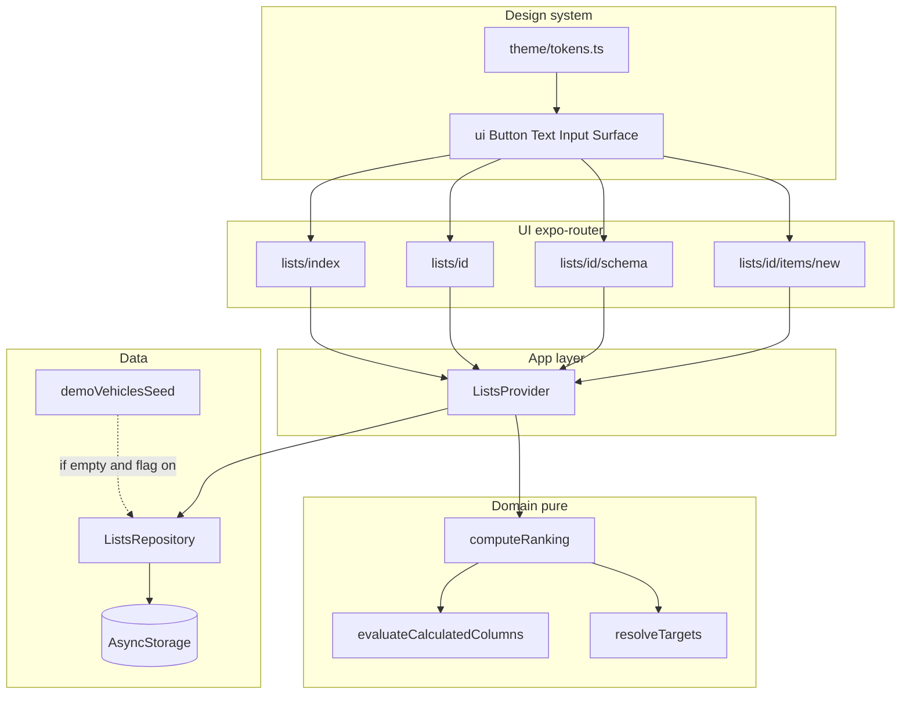

# feat: Ponderank app

## Summary

Reemplazar el starter de Expo SDK 57 por una app de comparación por ranking: listas con esquema configurable, motor de cálculo/ranking puro, formulario de items, filtros/orden, persistencia local detrás de un repositorio listo para Supabase, y un design system de un solo archivo de tokens (colores, tipografía, espaciado, radios, componentes) para que un cambio visual se propague a toda la app. Incluye seed demo de vehículos desactivable.

## Problem Frame

Hoy la comparación vive en hojas de cálculo con fórmulas frágiles (sentido menor/mayor mejor, columnas derivadas, pesos). El brainstorm define el producto; este plan define cómo montarlo sobre el template Expo existente (`src/app/*`, pnpm, sin persistencia ni tests aún).

---

## Requirements

Traceability to origin `docs/brainstorms/2026-07-24-ponderank-requirements.md`.

- R1–R3. CRUD de listas, items por formulario, variables globales por lista.
- R4–R8. Columnas texto/número/imagen/categoría; calculadas predefinidas con ejemplos; informativas vs ranking; edición de esquema con items existentes.
- R9–R14. Criterios: peso, objetivo (min/max/avg/custom), sentido; scores con tope 100%; pesos = 100%; faltante = 0%.
- R15–R18. Orden por cualquier columna; toggle % parciales; filtro por categoría; al filtrar preguntar si recalcular o mantener.
- R19–R20. Web + móvil; almacenamiento local desacoplado del dominio.
- Extra (plan): seed demo vehículos, fácil de quitar para productivo.
- Extra (plan): design system configurable desde un archivo central de tokens; pantallas y controles no hardcodean colores ni tipografías.

---

## Key Technical Decisions

- **AsyncStorage + repositorio, no SQLite en v1.** Dataset pequeño (decenas de items). AsyncStorage funciona bien en web y nativo. La clave para Supabase no es el motor local, sino un `ListsRepository` con entidades normalizadas que mapean 1:1 a tablas futuras (`lists`, `list_globals`, `list_columns`, `items`). Un `SupabaseListsRepository` posterior implementa la misma interfaz; el dominio y la UI no cambian. SQLite aportaría poco ahora y complica web.
- **Motor de ranking puro en TypeScript (sin React).** Funciones puras: evaluar columnas calculadas, resolver objetivos dinámicos, scores por criterio, ranking total. Facilita tests unitarios y evita acoplar UI a la lógica del Excel.
- **Estado de app vía contexto + hooks sobre el repositorio.** Sin Redux/Zustand en v1; un `ListsProvider` carga/guarda vía repositorio y expone acciones. Suficiente para un usuario/un dispositivo.
- **Seed demo detrás de flag.** `EXPO_PUBLIC_ENABLE_DEMO_SEED=true` (default en desarrollo) inserta la lista “Vehículos usados” solo si el storage está vacío. En productivo: flag `false` o eliminar `src/data/demo-vehicles-seed.ts`. No mezclar seed con el flujo normal de create-list.
- **Navegación stack + lista de listas.** Reemplazar tabs Home/Explore del starter por: índice de listas → detalle de lista (tabla/ranking) → editar esquema / formulario de item.
- **Design system: un archivo de tokens + primitivos.** Ampliar el patrón actual de `src/constants/theme.ts` hacia `src/theme/tokens.ts` como **única fuente de verdad** (colores light/dark, primary/secondary/danger/success, tipografía, spacing, radius, border, opacidades). Primitivos (`Button`, `Text`, `TextInput`, `Surface`, `IconButton`) leen solo tokens vía `useTheme()` / helpers; las pantallas **no** usan hex sueltos ni `fontSize` mágicos. Cambiar `tokens.colors.light.primary` actualiza todos los botones primarios. Sin NativeWind/Tamagui en v1 (menos capas; el archivo de tokens basta).
- **Tests del dominio con Vitest.** Añadir Vitest (rápido, ESM-friendly) solo para `src/domain/**`. UI sin E2E en v1.
- **Imágenes:** `expo-image-picker` + copiar a directorio de la app (`expo-file-system`) en nativo; en web, Object URL / data URL o FileReader. El valor de campo es string URI (https:// o file/local). `expo-image` para mostrar.

---

## High-Level Technical Design



**Tokens (forma esperada en `src/theme/tokens.ts`):**

```text
colors.light|dark: {
  text, textSecondary, textInverse,
  background, surface, surfaceMuted, border,
  primary, primaryPressed, primaryMuted,
  danger, success, warning
}
typography: { fontFamily, sizes: xs|sm|md|lg|xl|title, weights, lineHeights }
spacing: 2|4|8|12|16|24|32|48|64
radius: sm|md|lg|full
components: { buttonHeight, inputHeight, hitSlop }
```

Light/dark se resuelve con el hook existente (`useTheme` / color scheme); los primitivos eligen la paleta activa.

**Pipeline de ranking (por lista):**

1. Filtrar items visibles (categoría) si aplica.
2. Elegir universo de cálculo: todos los items **o** solo visibles (pregunta R18).
3. Evaluar columnas calculadas (orden topológico por dependencias entre columnas).
4. Resolver objetivos: custom | min | max | avg sobre valores numéricos no vacíos del universo.
5. Por cada criterio: score menor/mayor mejor (tope 100%); faltante → 0%.
6. Ranking total = Σ (score × peso/100). Rechazar esquema si Σ pesos ≠ 100 (±0.01).
7. Ordenar vista según columna elegida (default: ranking desc).

**Forma de entidades (alineada a Supabase futuro):**

```text
List { id, name, createdAt, updatedAt }
ListGlobal { id, listId, key, label, value: number }
ListColumn {
  id, listId, name, kind: text|number|image|category|calculated|criterion,
  options?: string[],              // category
  calc?: { op, leftRef, rightRef }, // refs: columnId | globalId
  rank?: { weight, direction: lowerBetter|higherBetter,
           target: { mode: min|max|avg|custom, customValue?: number } },
  order: number
}
Item { id, listId, values: Record<columnId, string|number|null>, createdAt }
```

`leftRef`/`rightRef` apuntan a `column:<id>` o `global:<id>`. Ops: `div|mul|add|sub|pct|globalDivCol|colMulGlobal` (ver R6).

---

## Scope Boundaries

**In scope**

- Full v1 del origin (R1–R20), navegación real, motor + tests, AsyncStorage, seed desactivable, imágenes URL/local, design system (tokens + primitivos).

**Deferred for later** (from origin)

- Plantillas, sync multi-dispositivo, export/import, adaptador Supabase real, import Excel automático, editor de fórmulas libre.

**Deferred to Follow-Up Work**

- Implementar `SupabaseListsRepository` y auth.
- E2E / Detox.
- Normalización estricta de floats de pesos en UI (sliders).

**Outside this product's identity**

- Colaboración multi-usuario, marketplace.

---

## Implementation Units

### U1. Domain: types, calc ops, ranking engine

- **Goal:** Motor puro que replica AE1–AE5 y AE7; sin I/O ni React.
- **Requirements:** R6–R7, R9–R14; AE1–AE5, AE7
- **Dependencies:** none
- **Files:**
  - Create: `src/domain/types.ts`
  - Create: `src/domain/calc-ops.ts` (ops + metadata con ejemplos para UI)
  - Create: `src/domain/evaluate.ts` (columnas calculadas, deps, div/0)
  - Create: `src/domain/ranking.ts` (targets, scores, total, weight sum check)
  - Create: `src/domain/ranking.test.ts`
  - Create: `vitest.config.ts`; update `package.json` scripts (`test`)
- **Approach:** Portar reglas del Excel/origin. Vacíos excluidos de min/max/avg. División por cero → valor calculado `null` (luego score 0 si es criterio). Pesos en 0–100 que deben sumar 100.
- **Execution note:** Implementar test-first contra AE1–AE5 y AE7.
- **Test scenarios:**
  - Covers AE1. Menor mejor: valor=target → 100%; valor=2×target → 50%.
  - Covers AE2. Mayor mejor: valor>target → 100%; valor=2/3 target → ~66.7%.
  - Covers AE3. Target mode `min` usa el mínimo no vacío de la columna.
  - Covers AE4. `assertWeightsSumTo100` falla si suma 90.
  - Covers AE5. Valor `null` en criterio → score 0; total baja.
  - Covers AE7. `colMulGlobal` produce costo informativo sin peso.
  - Edge: división por cero en calc → null.
  - Edge: avg ignora nulls.
- **Verification:** `pnpm test` verde; exports tipados usables desde UI.

### U2. ListsRepository + AsyncStorage + demo seed

- **Goal:** Persistencia local detrás de interfaz; seed vehículos desactivable.
- **Requirements:** R1, R20; seed extra
- **Dependencies:** U1
- **Files:**
  - Create: `src/data/lists-repository.ts` (interface)
  - Create: `src/data/async-storage-lists-repository.ts`
  - Create: `src/data/demo-vehicles-seed.ts` (datos del Excel: globals, columnas, 10 items)
  - Create: `src/data/create-repository.ts` (factory; punto futuro para Supabase)
  - Create: `src/data/async-storage-lists-repository.test.ts` (opcional, smoke con mock storage)
- **Approach:** Clave `ponderank:lists:v1`. Si storage vacío y `EXPO_PUBLIC_ENABLE_DEMO_SEED !== 'false'`, hidratar demo. Documentar en README cómo apagar seed. Valores de items del Excel: precio, puestos, consumo km/galón como columna número explícita (no enterrada en fórmula), 0-100, tipo categoría, imagen URL.
- **Test scenarios:**
  - Happy: create list → reload from storage → same data.
  - Happy: empty storage + seed flag on → vehicles list present.
  - Happy: seed flag off + empty → no lists.
  - Edge: second launch no duplica seed.
- **Verification:** Seed aparece una vez; flag off deja storage vacío limpio.

### U3. ListsProvider and view-model hooks

- **Goal:** Capa de app que orquesta repo + ranking para pantallas.
- **Requirements:** R15–R18 (lógica de vista), R2–R3
- **Dependencies:** U1, U2
- **Files:**
  - Create: `src/state/lists-context.tsx`
  - Create: `src/state/use-list-view.ts` (sort, filter, showPartials, recalculateMode prompt result)
- **Approach:** Al cambiar filtro, no recalcular en silencio: exponer `requestFilterChange` que la UI usa para mostrar diálogo (R18); luego `applyFilter({ recalculate: boolean })`. Ranking se calcula en memoria al leer.
- **Test scenarios:**
  - Covers AE6. Cambiar filtro sin confirmar no muta modo; tras “recalcular”, targets usan solo visibles; tras “mantener”, targets usan todos.
- **Verification:** Provider monta en layout; hooks tipados.

### U9. Design system: tokens + UI primitives

- **Goal:** Un solo archivo de tokens y primitivos reutilizables; cambiar primary/text/spacing ahí actualiza toda la app.
- **Requirements:** Extra design system
- **Dependencies:** none (puede ir en paralelo a U1–U2; **antes** de U4+)
- **Files:**
  - Create: `src/theme/tokens.ts` (fuente de verdad; migrar/ampliar desde `src/constants/theme.ts`)
  - Create: `src/theme/index.ts` (re-exports)
  - Modify: `src/hooks/use-theme.ts` (exponer tokens activos light/dark + helpers)
  - Create: `src/components/ui/button.tsx` (variants: primary, secondary, danger, ghost; sizes)
  - Create: `src/components/ui/text.tsx` (variants: body, title, subtitle, caption, label — reemplaza usos ad hoc de `ThemedText` en pantallas nuevas)
  - Create: `src/components/ui/text-input.tsx`
  - Create: `src/components/ui/surface.tsx` (fondos/cards de interacción)
  - Modify or thin: `src/components/themed-text.tsx`, `themed-view.tsx` (delegar a tokens o deprecar en favor de `ui/*`)
  - Create: `src/theme/README.md` (cómo cambiar colores / tipografía en un solo lugar)
- **Approach:** Regla: pantallas de la app importan `@/components/ui/*` y `@/theme`; prohibido hex literal en `src/app/**` y features. `Button` primary usa `tokens.colors.*.primary`. Mantener StyleSheet + tokens (práctica del template). Web: si `global.css` define fonts, sincronizar variables CSS con los mismos token names documentados.
- **Test scenarios:**
  - Happy: export `tokens.colors.light.primary` es string; `getTheme('light')` incluye primary y text.
  - Edge: light y dark exponen las mismas keys (type-level o test de keys).
- **Verification:** Story mínima o pantalla de preview opcional; cambiar primary en tokens cambia visualmente todos los `Button` primary sin tocar pantallas.

### U4. Navigation shell and lists index

- **Goal:** Quitar starter tabs; rutas reales de la app.
- **Requirements:** R1, R19
- **Dependencies:** U3, U9
- **Files:**
  - Modify: `src/app/_layout.tsx` (Stack + ListsProvider; quitar AppTabs splash tabs pattern o reducir)
  - Create: `src/app/index.tsx` → redirect o lista de listas
  - Create: `src/app/lists/index.tsx`
  - Create: `src/app/lists/[listId]/index.tsx` (placeholder hasta U6)
  - Delete or stop linking: `src/app/explore.tsx`, `src/components/app-tabs.tsx`, `app-tabs.web.tsx` (o dejar sin uso)
- **Approach:** `expo-router` Stack. Lista: crear/renombrar/eliminar listas. Solo primitivos `ui/*` + tokens.
- **Test expectation:** none — scaffolding de rutas; comportamiento cubierto en U6.
- **Verification:** `pnpm web` abre índice de listas; seed visible si flag on; botones usan primary del token.

### U5. Schema editor UI

- **Goal:** Configurar globals, columnas, pesos (sección suma 100%), ops con ejemplos.
- **Requirements:** R3–R13, F1
- **Dependencies:** U3, U4, U9
- **Files:**
  - Create: `src/app/lists/[listId]/schema.tsx`
  - Create: `src/components/schema/column-editor.tsx`
  - Create: `src/components/schema/weight-summary.tsx`
  - Create: `src/components/schema/calc-op-picker.tsx` (ejemplos desde `calc-ops` metadata)
- **Approach:** No permitir “listo” / guardar esquema de ranking si pesos ≠ 100 (AE4). Criterios eligen dirección y target mode. Columnas calculadas eligen op + refs. Controles vía design system.
- **Test scenarios:**
  - Covers AE4. UI muestra faltante y bloquea save (test de componente liviano o de helper `canSaveSchema`).
- **Verification:** Se puede recrear el esquema de vehículos a mano (sin seed).

### U6. List detail: table/ranking, sort, filter, item CRUD form

- **Goal:** Flujo principal de comparación y alta de items.
- **Requirements:** R2, R14–R18, F2–F4; AE6
- **Dependencies:** U5, U9
- **Files:**
  - Modify: `src/app/lists/[listId]/index.tsx`
  - Create: `src/app/lists/[listId]/items/new.tsx`
  - Create: `src/app/lists/[listId]/items/[itemId].tsx`
  - Create: `src/components/list/ranking-table.tsx`
  - Create: `src/components/list/filter-recalc-modal.tsx`
  - Create: `src/components/list/sort-controls.tsx`
  - Create: `src/components/list/partials-toggle.tsx`
  - Create: `src/components/list/item-form.tsx`
- **Approach:** Tabla scrollable (web) / lista densa (móvil). Toggle % parciales. Formulario dinámico según columnas de datos (no pedir calculadas). Confirmación al borrar columna ya en U5; aquí confirmación al borrar item. Estilos solo desde tokens/primitivos.
- **Test scenarios:**
  - Integration (domain+view-model): filtro + recalcular cambia orden vs mantener (Covers AE6).
- **Verification:** Con seed, orden por ranking coincide en espíritu con el Excel (Swift híbrido cerca del tope).

### U7. Image fields (URL + local attach)

- **Goal:** Columna imagen usable en form y en fila.
- **Requirements:** R5
- **Dependencies:** U6
- **Files:**
  - Create: `src/components/list/image-field-input.tsx`
  - Modify: `app.json` plugins for image-picker if required
  - Update deps: `expo-image-picker`, `expo-file-system` (versiones SDK 57)
- **Approach:** Consultar docs v57 antes de instalar. Guardar URI string en `item.values`. Mostrar con `expo-image`. Controles de “Adjuntar / URL” con `Button` del design system.
- **Test expectation:** none — platform I/O; smoke manual web + un dispositivo.
- **Verification:** Pegar URL del Excel funciona; adjuntar foto en móvil muestra thumbnail.

### U8. Productive readiness: README, seed off docs, cleanup

- **Goal:** Dejar claro cómo apagar seed, cómo retocar el design system, y limpiar restos del starter.
- **Requirements:** R20 success criteria; Extra design system
- **Dependencies:** U2–U7, U9
- **Files:**
  - Modify: `README.md`
  - Modify: `.env.example` with `EXPO_PUBLIC_ENABLE_DEMO_SEED`
  - Remove unused starter screens/assets references as needed
- **Approach:** Secciones “Demo seed”, “Design system (`src/theme/tokens.ts`)”, “Futuro Supabase (repositorio)”.
- **Test expectation:** none
- **Verification:** Con seed off, app arranca vacía; README refleja pnpm y el archivo de tokens.

---

## Phased Delivery

| Phase | Units | Outcome |
|-------|-------|---------|
| 1 Domain + data | U1–U2 | Motor testeado + storage + seed |
| 1b Design system | U9 | Tokens + Button/Text/Input/Surface |
| 2 Shell + schema | U3–U5 | Listas y esquema (sobre primitivos) |
| 3 Compare UX | U6–U7 | Ranking usable día a día |
| 4 Polish | U8 | Seed off docs + guía de tokens |

---

## Risk Analysis & Mitigation

- **Web vs native images:** APIs distintas → abstraer en `image-field-input` con `Platform` / `.web.tsx` si hace falta.
- **Float weights:** exigir enteros 0–100 o tolerancia 0.01; mostrar suma en vivo.
- **Calc dependency cycles:** detectar ciclo al guardar columna calculada y rechazar.
- **Seed vs datos reales:** flag + “solo si vacío” evita pisar datos del usuario.
- **Migración Supabase:** no implementar ahora; mantener interface y shape de entidades documentados en KTD.
- **Deriva visual:** pantallas con hex sueltos → regla de U9 + review: solo `ui/*` y tokens; documentado en `src/theme/README.md`.

---

## Open Questions

**Deferred to implementation**

- Layout exacto tabla vs cards en móvil estrecho.
- Límite de tamaño de imagen adjunta (comprimir o rechazar > N MB).

---

## Dependencies / Prerequisites

- Expo SDK 57 docs: https://docs.expo.dev/versions/v57.0.0/
- Añadir: `@react-native-async-storage/async-storage`, `vitest`, `expo-image-picker`, `expo-file-system` (versiones compatibles SDK 57).

---

## Sources & Research

- Origin requirements: `docs/brainstorms/2026-07-24-ponderank-requirements.md`
- Hoja de cálculo original (ranking `min(1,target/value)*weight`, globals, derived cols)
- Expo SQLite/AsyncStorage docs (Context7): SQLite kv-store es alternativa; se descartó para v1 por simplicidad web + dataset pequeño; el camino a Supabase es la interfaz del repositorio, no SQLite
- Repo actual: Expo Router template en `src/app`, alias `@/*`, sin tests ni persistencia
